# TaskFlow+ 📋

A smart mobile task management app built with **Flutter** and **Firebase**. TaskFlow+ helps users organize tasks effectively by analyzing deadlines and priorities, providing reminders, tracking progress, and delivering productivity insights.

---

## ✨ Features

- 🔐 **Authentication** — Register, login, logout with full inline validation and friendly error messages
- ✅ **Task Management** — Create, edit, delete tasks with title, description, priority, and deadline (date + time)
- 🎯 **Smart Priority Sorting** — Tasks sorted by priority score (priority level + deadline urgency)
- 🔴 **Overdue Detection** — Overdue tasks highlighted with red badge and warning icon
- 📊 **Dashboard Cards** — Live summary of Total, Done, Pending, and Overdue tasks
- 🔽 **Filter & Sort** — Filter by All / Today / Pending / Completed; sort by Priority, Deadline, or Recently Added
- 💡 **Smart Suggestions** — Context-aware tips based on your real task data
- 📈 **Productivity Insights** — Weekly bar chart, completion rate, best day, priority breakdown, overall progress
- 🔔 **Reminders** — Local notifications scheduled X hours before deadline or at 8 AM on deadline day
- 🔥 **Streak Counter** — Tracks consecutive days with at least one completed task
- 👆 **Swipe Gestures** — Swipe right to complete, swipe left to delete (with undo)
- 🌙 **Dark Mode** — Full Material 3 light/dark theming, persisted across restarts
- 👤 **Profile** — Set/update display name, change password
- 🗂️ **Drawer** — Profile, streak, insights, reminder settings, dark mode toggle, about

---

## 📱 Screenshots

### Authentication

| Login | Register |
|-------|----------|
| 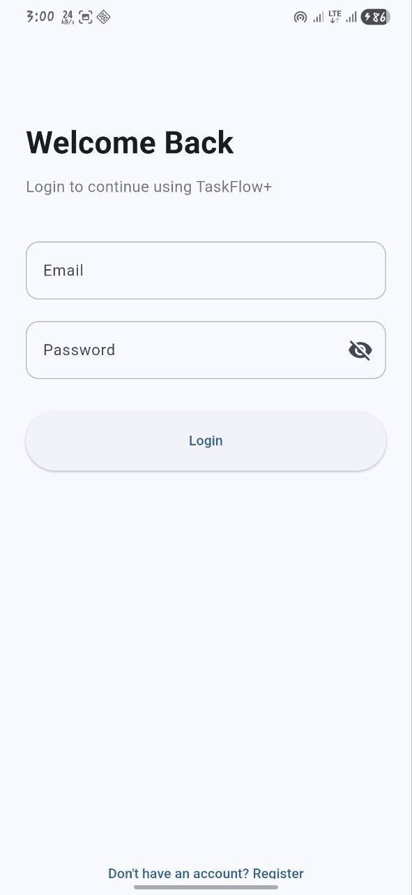 | 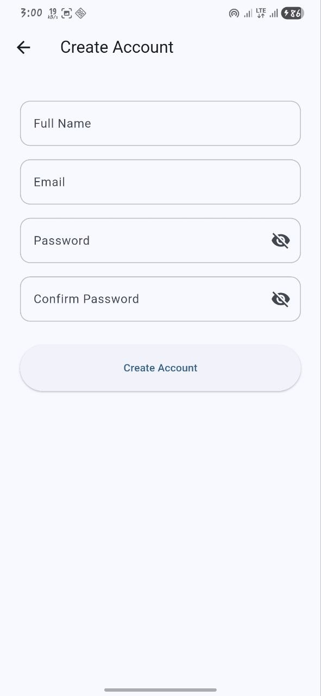 |

---

### Home Screen

| Light Mode | Dark Mode |
|------------|-----------|
| 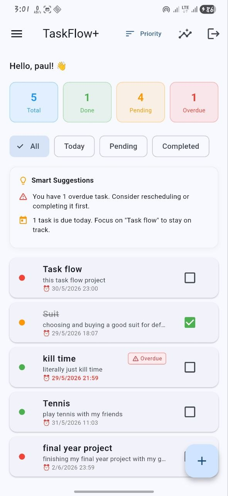 | 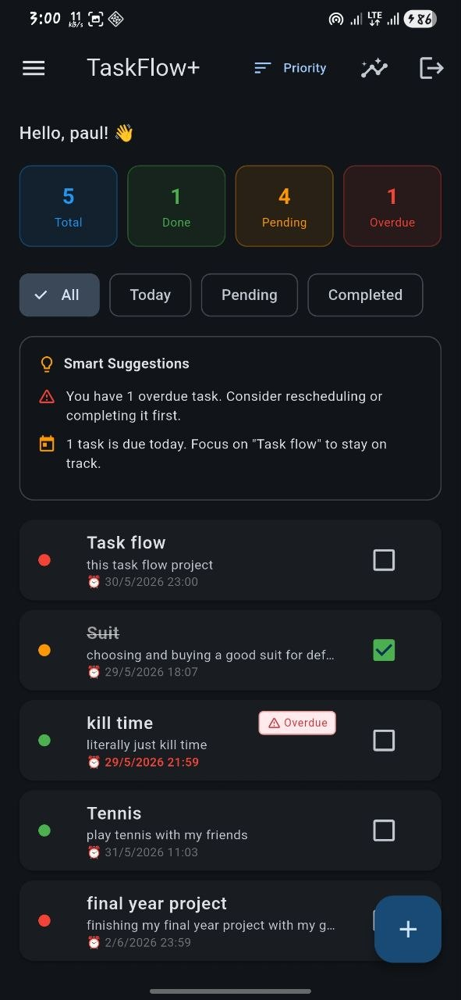 |

---

### Drawer

| Drawer |
|--------|
| 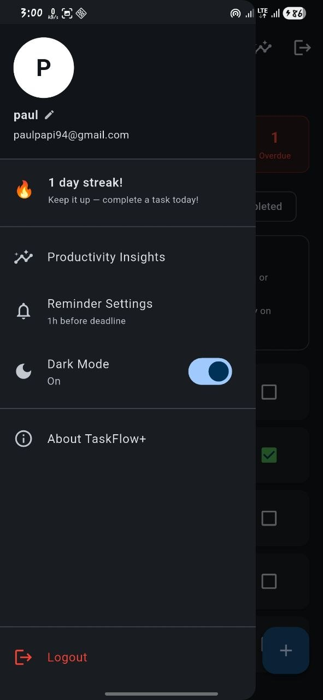

---

### Task Management

| Add Task | Edit Task |
|----------|-----------|
| 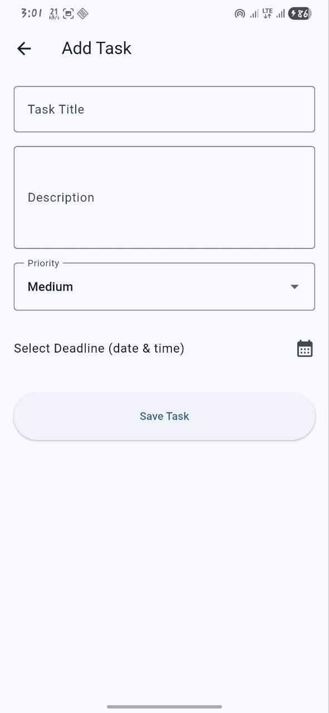 | 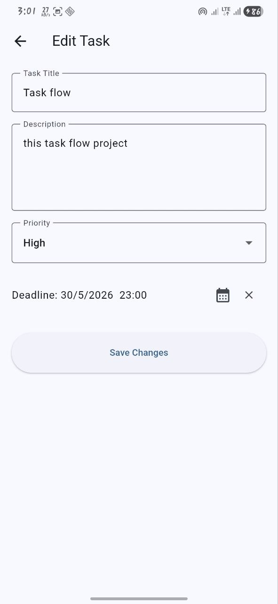 |

---

### Sorting & Filtering

| Sort Options | Filter — Pending |
|--------------|-----------------|
| 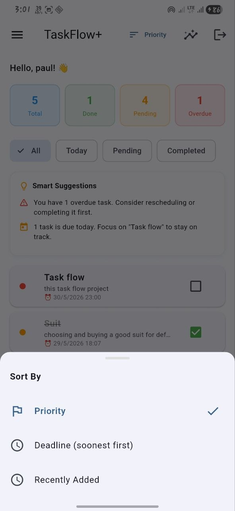 | 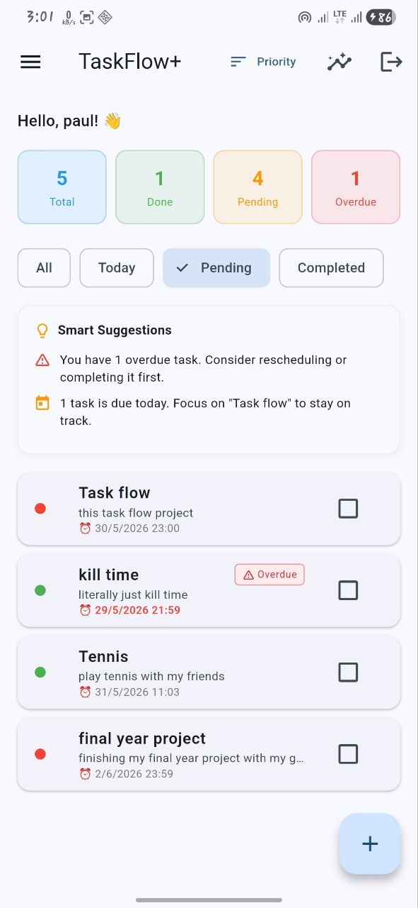 |

---

### Productivity Insights

| Insights Screen |
|----------------|
| 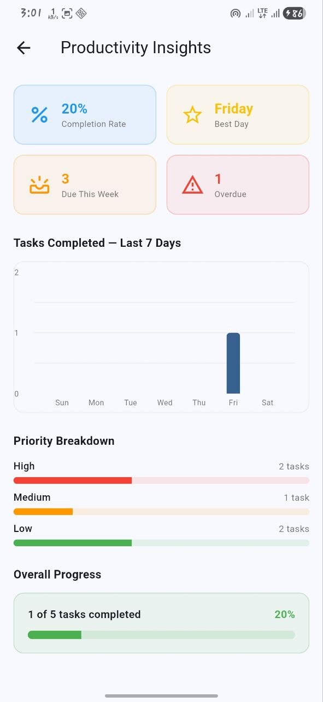 |

---

### Settings

| Reminder Settings | About |
|-------------------|-------|
| 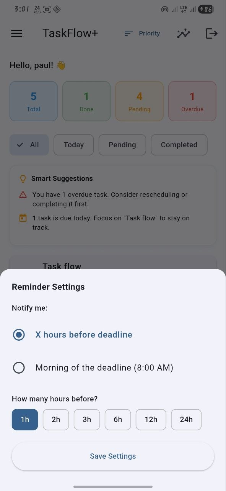 | 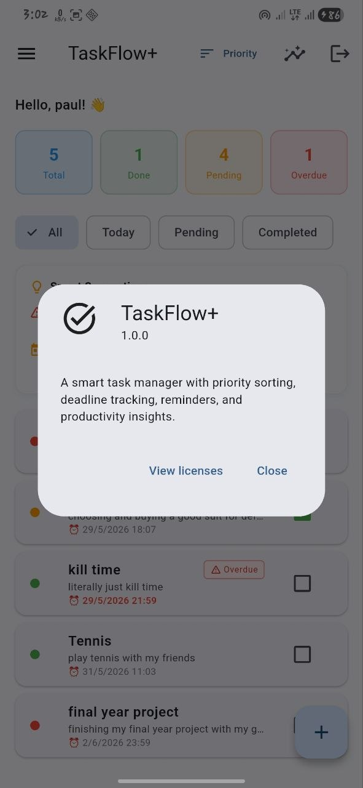 |

---

## 🛠️ Tech Stack

| Layer | Technology |
|-------|-----------|
| Framework | Flutter (Dart) |
| Backend / Auth | Firebase Authentication |
| Database | Cloud Firestore |
| State Management | Provider |
| Local Storage | SharedPreferences |
| Notifications | flutter_local_notifications |
| Charts | fl_chart |
| Target Platform | Android |

---

## 🗂️ Project Structure

```
lib/
├── main.dart
├── firebase_options.dart
├── providers/
│   └── theme_provider.dart
├── services/
│   └── notification_service.dart
└── features/
    ├── auth/
    │   ├── auth_wrapper.dart
    │   ├── screens/
    │   │   ├── login_screen.dart
    │   │   ├── register_screen.dart
    │   │   └── profile_screen.dart
    │   └── services/
    │       ├── auth_service.dart
    │       └── user_service.dart
    ├── home/
    │   ├── home_screen.dart
    │   └── widgets/
    │       └── suggestions_card.dart
    ├── tasks/
    │   ├── models/
    │   │   └── task_model.dart
    │   ├── screens/
    │   │   ├── add_task_screen.dart
    │   │   └── edit_task_screen.dart
    │   ├── services/
    │   │   └── task_service.dart
    │   └── utils/
    │       └── priority_calculator.dart
    └── analytics/
        ├── screens/
        │   └── insights_screen.dart
        └── services/
            └── analytics_service.dart
```

---

## 🚀 Getting Started

### Prerequisites
- Flutter SDK
- Firebase project with Authentication and Firestore enabled
- Android device or emulator (API 21+)

### Setup

1. **Clone the repository**
   ```bash
   git clone https://github.com/paulGitRoot/taskflow-plus.git
   cd taskflow-plus
   ```

2. **Install dependencies**
   ```bash
   flutter pub get
   ```

3. **Add your Firebase config**
   - Create a Firebase project at [console.firebase.google.com](https://console.firebase.google.com)
   - Enable Email/Password Authentication
   - Enable Cloud Firestore
   - Download `google-services.json` and place it in `android/app/`
   - Run `flutterfire configure` to generate `firebase_options.dart`

4. **Create Firestore composite index**
   - Collection: `tasks`
   - Fields: `userId` (Ascending) + `priorityScore` (Descending)

5. **Run the app**
   ```bash
   flutter run
   ```

---

## 🔒 Firestore Security Rules

Update your Firestore rules before production:

```javascript
rules_version = '2';
service cloud.firestore {
  match /databases/{database}/documents {
    match /tasks/{taskId} {
      allow read, write: if request.auth != null
        && request.auth.uid == resource.data.userId;
      allow create: if request.auth != null
        && request.auth.uid == request.resource.data.userId;
    }
    match /users/{userId} {
      allow read, write: if request.auth != null
        && request.auth.uid == userId;
    }
  }
}
```

---

## 📸 Adding Screenshots to This README

1. Create a `screenshots/` folder in the root of your repo
2. Add the following images with these exact filenames:

| Filename | Screen |
|----------|--------|
| `login.jpg` | Login screen |
| `register.jpg` | Register screen |
| `home_light.jpg` | Home screen (light mode) |
| `home_dark.jpg` | Home screen (dark mode) |
| `drawer.jpg` | Side drawer |
| `add_task.jpg` | Add task screen |
| `edit_task.jpg` | Edit task screen |
| `sort.jpg` | Sort options |
| `filter_pending.jpg` | Filter chips |
| `insights.jpg` | Productivity insights |
| `reminder_settings.jpg` | Reminder settings |
| `about.jpg` | About dialog |

## 📄 License

This project is for educational purposes. Feel free to use it as a reference for your own Flutter + Firebase projects.
